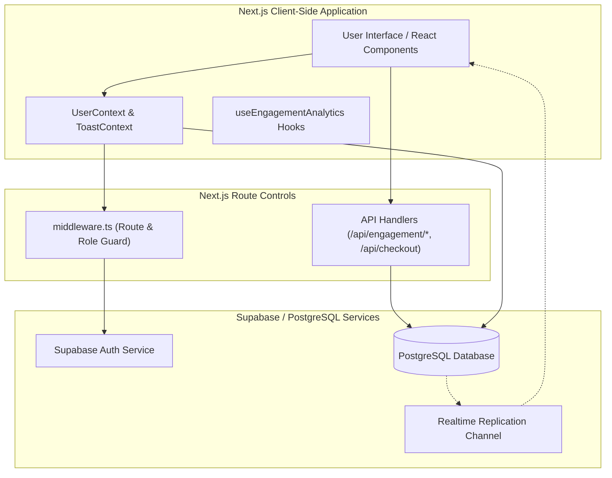
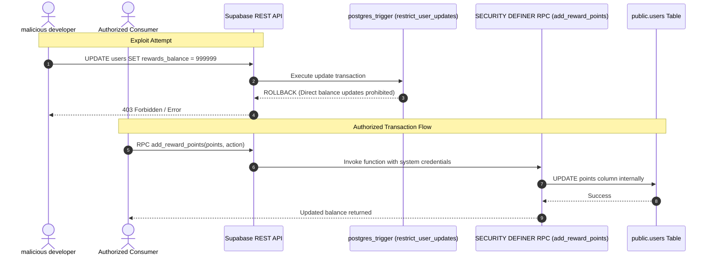
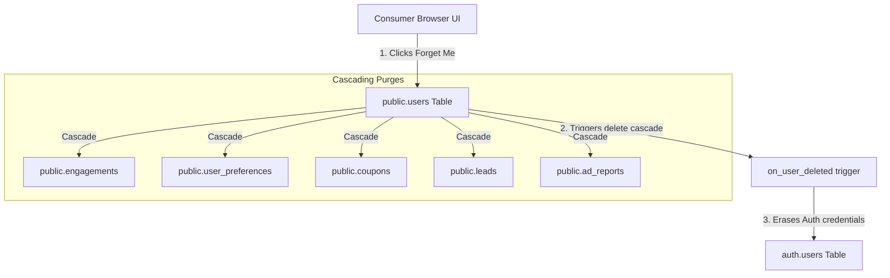
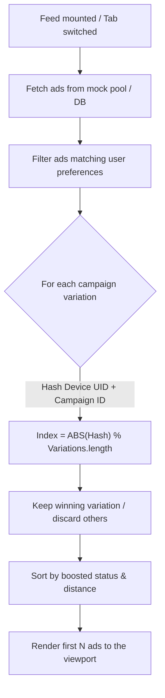
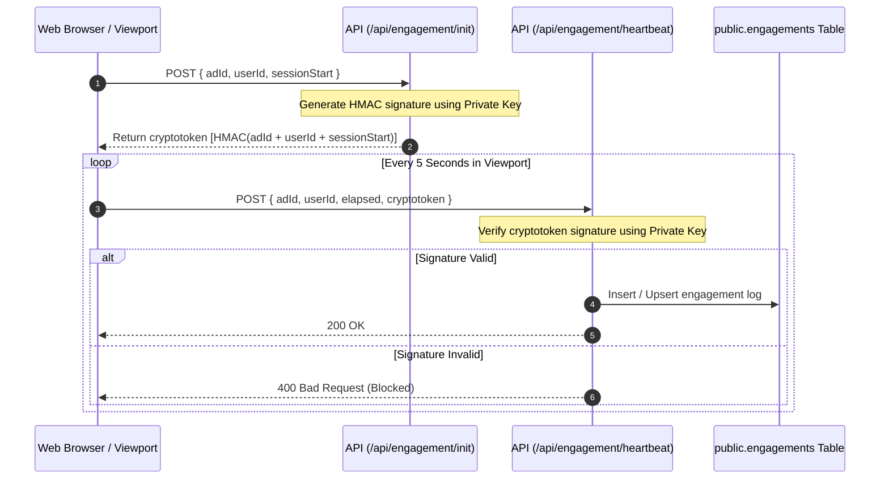

# Architecture & Design Specifications

This document defines the system topology, security boundaries, database structures, and analytical pipelines of the AdMe platform.

---

## 1. High-Level System Architecture

AdMe uses a hybrid Next.js 16 App Router frontend integrated with a hardened Supabase backend. Session security and route routing are managed by Next.js middleware combined with PostgreSQL Row-Level Security (RLS) policies.

---

## 2. Security & Ledger Point Controls

To prevent balance modification exploits from the browser, direct client updates to point balances are restricted.

*   **Balance Protection Trigger**: A database trigger blocks direct `UPDATE` operations on point columns.
*   **Security Definer RPCs**: Balance changes must be requested through secure remote procedure calls (RPC) executing with elevated execution context (`SECURITY DEFINER`).

---

## 3. GDPR Cascade Erasure (Right-to-be-Forgotten)

AdMe stores zero personally identifiable information (PII) on consumers. However, to guarantee complete deletion under GDPR and CCPA rules, a single profile deletion triggers database and auth cascades.

---

## 4. Sticky A/B Testing & Feed Pipeline

To ensure A/B test results are statistically valid, users must consistently see the same variation for a campaign throughout their sessions.

---

## 5. Cryptographic Viewport Heartbeat Sequence

To prevent dwell-time spoofing (where clients artificially pad viewing durations to farm points), dwell metrics are signed with HMAC hashes.

