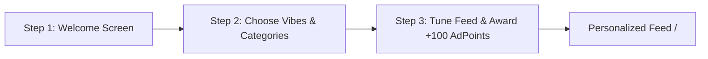
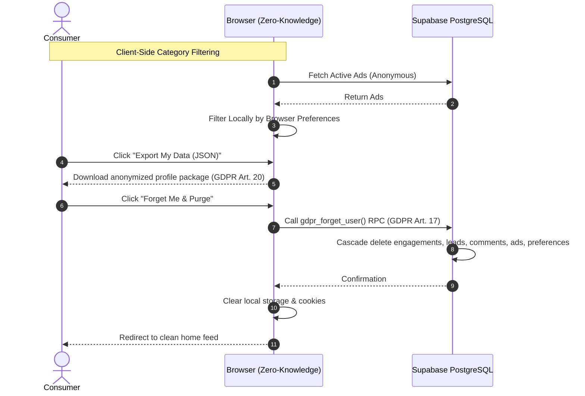

# AdMe ── User & Developer How-To Guide

Welcome to the comprehensive **AdMe How-To Guide**. This document walks you through accessing the live cloud SaaS app on Vercel, navigating everyday consumer and business workflows, using the privacy features, and setting up local development.

---

## 🚀 Quick Access: Live SaaS Deployment

You can access and test the production application directly in your browser without any local setup:

| Environment | Direct URL | Description |
| :--- | :--- | :--- |
| **Official Production SaaS** | [https://www.adforme.io](https://www.adforme.io) | Official Production deployment |
| **Vercel Mirror** | [https://ad-me.vercel.app](https://ad-me.vercel.app) | Direct Vercel deployment mirror |
| **Mirror Deployment** | [https://adme-psi.vercel.app](https://adme-psi.vercel.app) | Alternative production mirror |
| **Backend & Database** | Hosted on [Supabase](https://supabase.com) | Real-time PostgreSQL, GoTrue Auth & RLS policies |

> [!TIP]
> **No registration required to explore**: Click the **Persona Switcher** in the top navigation bar to instantly test with preloaded personas (e.g., *Sarah the Developer*, *Marcus the Foodie*, or *Valor Brews Business Owner*).

---

## 🧭 Table of Contents
1. [Switching Languages (English / Spanish)](#1-switching-languages-english--spanish)
2. [Consumer Journey: Sign Up & Onboarding](#2-consumer-journey-sign-up--onboarding)
3. [Earning & Redeeming Rewards (AdPoints)](#3-earning--redeeming-rewards-adpoints)
4. [Using Vouchers with Barcode & 2D QR Scanner](#4-using-vouchers-with-barcode--2d-qr-scanner)
5. [Business Journey: Sign Up & Studio Access](#5-business-journey-sign-up--studio-access)
6. [Creating & Managing Ad Campaigns](#6-creating--managing-ad-campaigns)
7. [Managing Inbound Customer Leads](#7-managing-inbound-customer-leads)
8. [Privacy, Data Portability & GDPR Forget Me](#8-privacy-data-portability--gdpr-forget-me)
9. [Developer Guide: Local Development & Testing](#9-developer-guide-local-development--testing)

---

## 1. Switching Languages (English / Spanish)

AdMe features complete multi-language localization with key parity across English (`en-US`) and Puerto Rican Spanish (`es-PR`).

1. Open the app at [https://ad-me.vercel.app](https://ad-me.vercel.app).
2. Locate the **Language Switcher** in the navigation header (next to the persona badge).
3. Click the globe or locale button:
   - Select **EN** for English.
   - Select **ES** for Spanish (`Español`).
4. The application catalog refreshes immediately without requiring a full page reload.

---

## 2. Consumer Journey: Sign Up & Onboarding

### Creating a Consumer Account
1. Navigate to `/login` (or click **Sign In** in the header).
2. Click the **Create Account** tab.
3. Keep the account type toggled to **Individual / Consumer**.
4. Enter your email and a password (minimum 6 characters).
5. Click **Create individual account**.
6. The system automatically signs you in and routes you to `/onboarding`.

### 3-Step Preference Onboarding

1. **Step 1 (Welcome)**: Learn how permission-based ads reward your attention. Click **Let's go**.
2. **Step 2 (Vibes)**: Click your favorite category pills (e.g., *Tech & SaaS*, *Local Eateries*, *Home & Garden*, *Gaming*).
3. **Step 3 (Curating)**: The system automatically grants a **100 AdPoints Welcome Bonus** to your account and generates your personalized feed.

---

## 3. Earning & Redeeming Rewards (AdPoints)

In AdMe, users are rewarded for their voluntary attention instead of being tracked:

### How to Earn Points:
* **Engaging with Ads**: Click on ads, view video demos, or read sponsor messages (+10 to +30 AdPoints).
* **Proximity Scratch Cards**: When walking near a participating merchant (within 0.25 miles), scratch the canvas card (+50 AdPoints).
* **Interactive Preference Polls**: Swipe cards in the Rewards Hub to tune ad recommendations (+15 AdPoints per vote).
* **Daily Streaks**: Check in consecutive days to earn streak multipliers.

### How to Redeem Points:
1. Navigate to `/rewards`.
2. Browse the **Rewards Marketplace** for local coffee shop discounts, tech subscriptions, or gift cards.
3. Click **Redeem** on any perk with sufficient balance.
4. An instant digital voucher with an alphanumeric code is created in your **Voucher Wallet**.

---

## 4. Using Vouchers with Barcode & 2D QR Scanner

When visiting a physical store or redeeming an offer online:

1. Open the **Profile** page (`/profile`) or **Voucher Wallet** modal.
2. Click on the desired active voucher card.
3. **Toggle Scanner Format**:
   - **Code-128 Barcode**: Ideal for traditional laser checkout scanners.
   - **2D QR Code**: High-contrast 25×25 module matrix with corner finder patterns for camera apps and tablets.
4. **Cashier / In-Store Verification**:
   - The cashier enters their merchant staff PIN (default: `1234`).
   - Click **Verify & Redeem In-Store**.
   - The voucher status instantly updates to `Redeemed` with timestamp and verification audit trail.

---

## 5. Business Journey: Sign Up & Studio Access

Small and local businesses have equal access to high-intent audiences without needing giant marketing budgets:

1. Navigate to `/login`.
2. Click **Create Account**.
3. Select the **Business account** toggle button.
4. Fill in:
   - **Company / Brand Name** (e.g., *Apex Local Roasters*).
   - **Business Email** and **Password**.
5. Click **Create business account**.
6. You will be redirected straight to the **Business Ad Studio** at `/studio`.

---

## 6. Creating & Managing Ad Campaigns

### Launching a Campaign
1. From `/studio`, click **+ Create New Campaign** (or go to `/studio/create`).
2. **Select Ad Format**:
   - **Native Feed**: Seamless post integrated in consumer feeds.
   - **Carousel**: Swipeable multi-card visual narrative.
   - **Geofenced Drop**: Triggered when consumers walk near specific GPS coordinates.
3. **Campaign Details**:
   - Enter Headline, Brand Name, Target Category, and Image URL.
   - For Geofenced campaigns, enter Latitude & Longitude (e.g., `34.0123`, `-118.4921`).
4. **Bidding & Budget**:
   - Set Max Cost-Per-Click (CPC) bid in AdPoints.
   - Allocate daily budget limit.
5. Click **Launch Campaign** (deducts 50 AdCredits balance).

### Lifecycle Controls (Pause, Edit Budget, Archive)
Inside `/studio`:
* **Pause / Resume**: Click the `⏸ Pause` / `▶ Resume` button to immediately halt or restart impressions.
* **Edit Budget**: Click `✏ Edit Budget` to open the modal and adjust the daily AdPoints cap.
* **Archive**: Click `🗑 Archive` to permanently decommission completed campaigns.

---

## 7. Managing Inbound Customer Leads

When consumers click "Request Info" or message a sponsor, leads appear instantly in the **Inbound Leads Cockpit**:

1. Open `/studio` and scroll to **Inbound Customer Leads**.
2. **Filter Leads**: Use the pipeline pills (`All`, `New`, `Contacted`, `Closed`).
3. **Take Action**:
   - Click `Mark Contacted` after emailing or calling the customer.
   - Click `Close Lead` once the inquiry is resolved.
   - Click `Reopen` if follow-up is needed.

---

## 8. Privacy, Data Portability & GDPR Forget Me

AdMe puts consumers in total control of their data footprint:



* **Zero-Knowledge Feed Blending**: Category filtering happens in your browser—preferences are never sent in ad query requests.
* **Data Portability (GDPR Art. 20)**: Go to `/profile` and click **Export My Data (JSON)** to download a full JSON record of your anonymous profile.
* **Right to be Forgotten (GDPR Art. 17)**: Click **Forget Me & Purge Account**. This invokes the atomic `gdpr_forget_user()` database RPC, cascading across all tables and purging all data immediately.

---

## 9. Developer Guide: Local Development & Testing

### Prerequisites
* **Node.js 18+**
* **Supabase CLI** (optional for local database container)

### Setup Instructions
```bash
# 1. Clone repository
git clone https://github.com/ricardojjulia/AdMe.git
cd AdMe

# 2. Install dependencies
npm install

# 3. Environment configuration
cp .env.local.example .env.local # or configure NEXT_PUBLIC_SUPABASE_URL

# 4. Start local development server
npm run dev
# Open http://localhost:3400
```

### Running Test Suites
```bash
# Run Vitest unit & integration tests (58 tests)
npm run test

# Run Playwright End-to-End browser tests (12 tests)
npm run test:e2e

# Compile production Next.js build
npm run build
```
