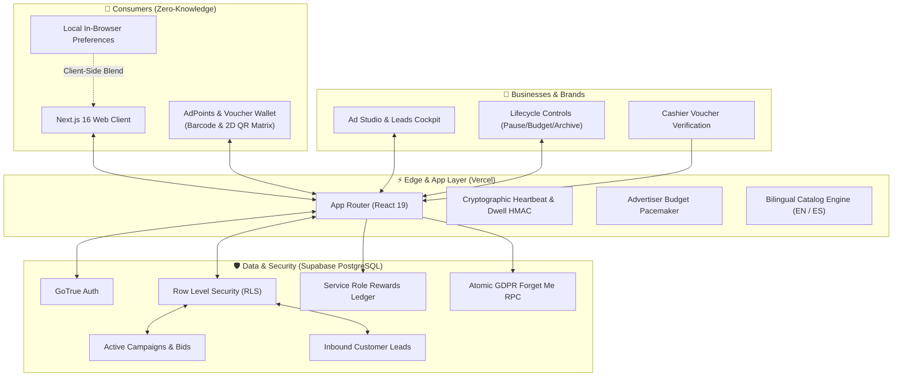
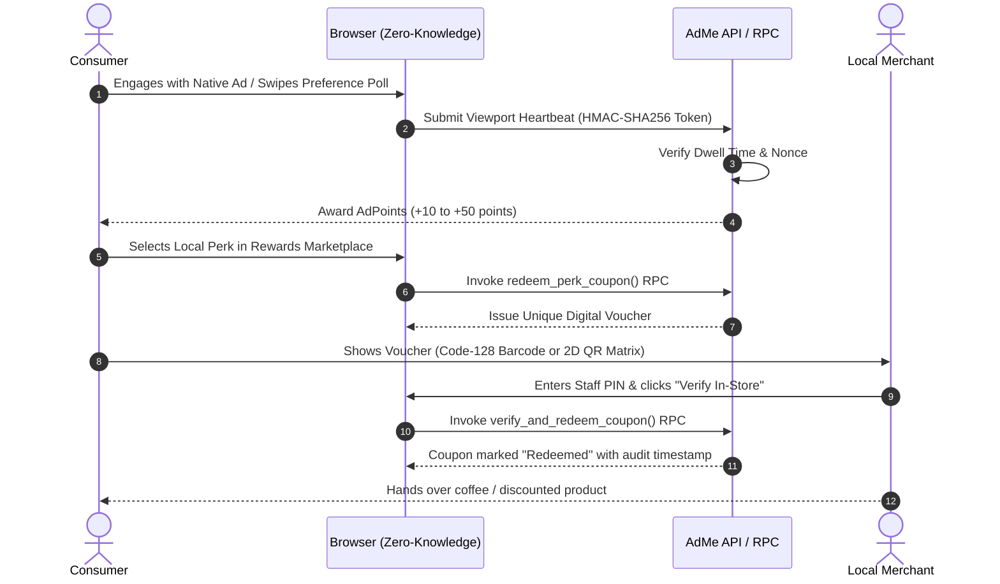
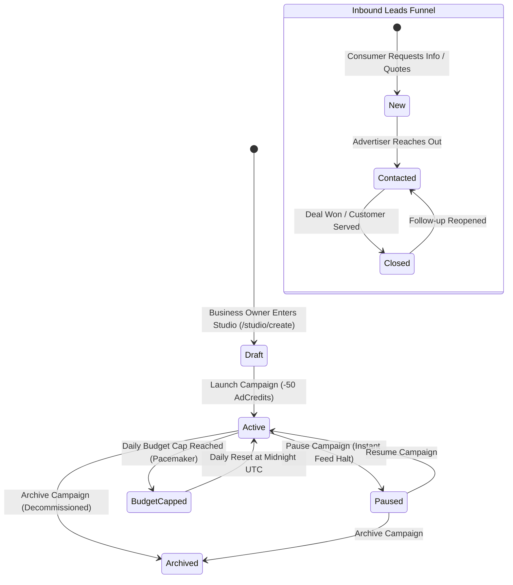

# AdMe ── The World's First Privacy-First, Permission-Based Advertising Marketplace

[](https://github.com/ricardojjulia/AdMe/releases)
[](https://www.gnu.org/licenses/agpl-3.0.en.html)
[](https://nextjs.org/)
[](https://supabase.com/)
[](#-testing--quality-assurance)

> **"We know what you like, but we don't know who you are."**

AdMe is a revolutionary discovery platform built to fix digital advertising for both consumers and businesses. Instead of surveillance-based tracking, AdMe operates as a consent-first, privacy-first ad marketplace. Users voluntarily control their preferences, maintain complete anonymity through hashed UIDs, and earn value for their attention. Small and local businesses get an affordable, level playing field to reach high-intent customers without paying massive platform taxes.

---

## 🌐 Live SaaS Hosted Application (Vercel)

You can launch and interact with the hosted SaaS web application immediately in your browser:

| Environment | Hosted SaaS URL | Status | Description |
| :--- | :--- | :--- | :--- |
| **Primary SaaS Platform** | [**https://ad-me.vercel.app**](https://ad-me.vercel.app) | `Active` | Production SaaS release hosted on Vercel |
| **Backup SaaS Mirror** | [**https://adme-psi.vercel.app**](https://adme-psi.vercel.app) | `Active` | Alternative mirror deployment |
| **Database & Auth** | **Supabase Cloud** | `Active` | Managed PostgreSQL with GoTrue Auth & RLS |

### ⚡ Quick Ways to Explore the SaaS App:
1. **Explore Instant Demo Personas**: Click the floating **Persona Switcher** in the top navigation bar to test the application as *Sarah (Tech Dev)*, *Marcus (Local Foodie)*, *Elena (New Consumer)*, or *Valor Brews (Business Owner)* without entering credentials.
2. **Create a Fresh Account**: Head directly to [/login](https://ad-me.vercel.app/login) and toggle to **Create Account** to experience individual onboarding (+100 welcome AdPoints bonus) or register a business.
3. **Change Languages**: Click the language toggle in the header to switch instantaneously between English (`EN`) and Puerto Rican Spanish (`ES`).
4. **Read the Full Step-by-Step Guide**: See **[HOW-TO.md](./HOW-TO.md)** for complete end-to-end user workflows.

---

## 🏗️ System Architecture & Visual Topology

### 1. High-Level Marketplace Topology


### 2. Value-Exchange Lifecycle: Attention to Real-World Discounts


### 3. Business Campaign Lifecycle & Inbound Leads Funnel


---

## 🎯 The Core Problems We Solve

### 1. Ad Relevance Without Surveillance (Consumers)
Nobody wants diapers when they don’t have children, or political ads they disagree with. Users select precisely what they want to discover (e.g., Tech, Local restaurants, Home renovation, Veteran-owned businesses).

### 2. High-Outcome Local Discovery (Small Businesses)
Traditional platforms (Google, Meta, TikTok) favor big spenders, burying local restaurants, coffee shops, contractors, and authors. AdMe provides transparent CPC bidding, daily budget pacemakers, and low-cost subscription tiers allowing small businesses to compete and build volume first.

### 3. Absolute Privacy by Design
Meta and TikTok monitor every click, scroll, and keystroke. AdMe stores **zero personally identifiable information (PII)** in the public application layer. Attacker breaches yield only anonymous interaction lists, which are virtually worthless.

---

## 🌟 Key Application Features

### 1. Unified Consumer Experience
*   **Voluntary, Curated Feed**: Ad recommendations driven entirely by user-toggled categories.
*   **Zero-Knowledge Contextual Feed**: Mock organic social posts and category ads are fetched globally and filtered strictly in-browser—user preferences are never sent in ad query requests.
*   **Local Differential Privacy (LDP) Shield**: Optional randomized response perturbation (double-coin-flip math) for preference synchronization, providing mathematically provable plausible deniability.
*   **Interactive Barcode & 2D QR Voucher Wallet**: Instant switching between Code-128 linear barcodes and HTML canvas-rendered 2D QR codes with cashier verification PIN support.
*   **Proximity Compass Maps & Scratch Cards**: Real-time compass navigation and canvas scratch cards rewarding users with +50 points when walking within 0.25 miles of local merchants.
*   **Gamified Preference Swipe Polls**: Swipe card decks in the Rewards Hub that reward users with points for refining their interest profiles.
*   **GDPR Article 17 & 20 Compliance**: One-click complete anonymous JSON profile data download and an atomic `gdpr_forget_user` cascade purge.

### 2. Business Ad Studio & Inbound Leads Cockpit
*   **Campaign Lifecycle Controls**: Instant inline status management (`Active`, `Paused`, `Archived`) and live daily AdPoints budget editing.
*   **Inbound Leads Cockpit**: Complete customer lead management pipeline (`New` -> `Contacted` -> `Closed`) with real-time status badges and filter pills.
*   **Real-Time RTB Auction Board**: Max CPC bid updates with live position previews against active competitors.
*   **Advertiser Budget Pacemaker**: Compares elapsed daily time against spend velocity to throttle impressions smoothly across 24 hours.
*   **A/B Test Engine & Statistical Significance**: Native split-testing variants evaluated with normal CDF Z-score calculators.

### 3. 100% Bilingual Localization (EN / ES)
*   Canonical English (`catalog.en-US.json`) and Puerto Rican Spanish (`catalog.es-PR.json`) with complete translation key parity across all routes, modals, and error states.
*   Backed by our tenant-bound Localization Governance framework supporting automated translation validation and review workflows.

---

## 📁 Repository Structure

```
├── docs/                     # Architecture decisions & setup guides
├── public/                   # Static assets, branding, and icons
├── supabase/                 # Supabase Local Development & Migrations
│   ├── config.toml           # Supabase CLI configuration
│   └── migrations/           # Versioned SQL migrations (RLS, Ledger, GDPR, Leads)
├── src/
│   ├── app/                  # Next.js 16 App Router
│   │   ├── api/              # API endpoints (Checkout, Heartbeat, Engagement)
│   │   ├── auth/             # Auth callbacks
│   │   ├── hq/               # AI-Governed Council HQ Dashboard
│   │   ├── login/            # Segmented Sign In / Create Account
│   │   ├── onboarding/       # 3-step preference discovery
│   │   ├── profile/          # Wallet, preferences, GDPR export & purge
│   │   ├── rewards/          # Rewards store marketplace & swipe polls
│   │   └── studio/           # Campaign dashboard, builder & leads cockpit
│   ├── components/           # Reusable components (Feed, CouponWallet, Cards)
│   ├── lib/                  # Core contexts, hooks, and Supabase client
│   │   ├── i18n/             # Canonical EN and ES translation catalogs
│   │   └── UserContext.tsx   # Global state & authenticated session management
│   └── types/                # TypeScript interface declarations
├── tests/
│   ├── unit/                 # Unit tests (Campaign lifecycle, RTB auctions, geofence)
│   ├── integration/          # Integration tests (Stripe checkout, HMAC heartbeats)
│   ├── localization/         # Localization governance test suite
│   └── e2e/                  # Playwright browser end-to-end test suite
├── HOW-TO.md                 # Complete user & developer how-to guide
├── CHANGELOG.md              # Historical version changelog (Keep a Changelog)
├── ARCHITECTURE.md           # Visual architecture diagrams and security models
└── README.md                 # Repository entry point
```

---

## 🧪 Testing & Quality Assurance

AdMe enforces automated testing across all layers:

### 1. Vitest Unit & Integration Tests (58 / 58 Passing)
```bash
npm run test
```
* **Coverage**: RTB auction ranking, deterministic A/B variation hashing, budget pacing calculations, geofence distance algorithms, HMAC engagement verification, checkout validation, and localization governance.

### 2. Playwright End-to-End Browser Tests (12 / 12 Passing)
```bash
npm run test:e2e
```
* **Automated Journeys Tested**:
  1. Brand homepage & value proposition verification
  2. Persona switcher state transitions
  3. Proximity deals simulation and geofence alerts
  4. GDPR "Forget Me" database cascade & session purge
  5. Swipeable preference deck & AdPoints rewards
  6. Ad Studio campaign selection & Max CPC bid updates
  7. Rewards marketplace search, filtering, and voucher redemption
  8. Business owner campaign status management & inbound leads pipeline
  9. Barcode / 2D QR matrix display toggle & in-store verification
  10. Anonymous JSON profile export (GDPR Article 20)
  11. **Consumer account creation, 3-step onboarding & welcome bonus**
  12. **Business account creation with brand name & direct Studio routing**

### 3. Production Build Compilation
```bash
npm run build
```
* Clean Next.js 16 compile in under 2 seconds with zero TypeScript or ESLint warnings.

---

## 🚀 Local Development Setup

### 1. Prerequisites
* **Node.js 18+**
* **Supabase CLI** (optional for local database container)

### 2. Installation
```bash
git clone https://github.com/ricardojjulia/AdMe.git
cd AdMe
npm install
```

### 3. Environment Configuration
Create `.env.local` in the project root:
```env
NEXT_PUBLIC_SUPABASE_URL=http://127.0.0.1:53321
NEXT_PUBLIC_SUPABASE_ANON_KEY=your_supabase_anon_key
```

### 4. Run Development Server
```bash
npm run dev
# Application starts at http://localhost:3400
```

---

## 📄 License
This project is licensed under the **GNU Affero General Public License v3.0 (GNU AGPL-3.0)** - see the [LICENSE](./LICENSE) file for details.
