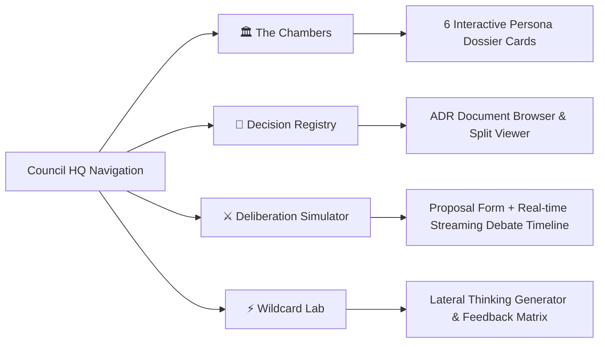

# Autonomous AI Architecture Council: Architecture Blueprint & Implementation Specification

> **A Universal Blueprint for Multi-Agent Software Governance, Architectural Deliberation, and Automated Decision Recording (ADR).**

---

## 1. Executive Overview & Problem Statement

### 1.1 The Problem
When autonomous AI coding agents (or human developers under sprint pressure) make software changes, they frequently suffer from **single-perspective bias**:
* The developer focuses on getting the feature to work, neglecting regression testability.
* The feature is built, but security boundaries (authentication, authorization, Row-Level Security, PII protection) are overlooked.
* Data schemas are modified ad-hoc without indexing or migration reversibility.
* Architecture drifts away from established patterns, creating technical debt.

### 1.2 The Solution
The **Autonomous AI Architecture Council** is an interactive, multi-agent architectural governance system. It simulates an expert engineering board composed of **six specialized AI personas plus an optional wildcard member**. 

Before significant features or architectural shifts are coded, a proposal is submitted to the Council. The personas deliberate in real time, scrutinize the design from their distinct professional domains, issue binding amendments, cast formal votes, and—upon majority approval—automatically generate and commit an immutable **Architecture Decision Record (ADR)** directly into the repository.

```mermaid
flowchart TD
    User["Developer / AI Agent"] -->|Submits Title, Context, Decision| Submission["Proposal Submission"]
    Submission --> Deliberation["Multi-Agent LLM Deliberation Engine"]
    
    subgraph Council["🏛️ The 6-Persona Architecture Board"]
        Architect["🏛️ The Architect<br/>System Topology & Modularity"]
        Engineer["⚙️ The Engineer<br/>Complexity & Feasibility"]
        Security["🛡️ The Security Lead<br/>Attack Surfaces & RLS"]
        Product["🎯 The Product Owner<br/>User Value & ROI"]
        QA["🧪 The QA Lead<br/>Testability & Regression"]
        Data["💾 The Data Engineer<br/>Schema & Reversibility"]
    end
    
    Deliberation --> Council
    Council --> DebateLoop["Debate Streaming / Simulation"]
    DebateLoop --> Votes["Vote Aggregation (YES/NO)"]
    Votes --> Verdict{"Verdict: Approved?"}
    
    Verdict -->|Yes (≥4/6 Votes)| Ratified["Status: RATIFIED"]
    Verdict -->|No (<4 Votes)| Rejected["Status: REJECTED"]
    
    Ratified --> Amendments["Extract Binding Amendments & Implementation Mandate"]
    Amendments --> ADRGen["Generate COUNCIL-YYYY-NNN.md"]
    ADRGen --> Filesystem["Save to docs/decisions/"]
    Filesystem --> LiveRegistry["Hydrate Live Decision Registry UI"]
```

---

## 2. Persona Specifications & Prompt Engineering

Each council member has a strictly defined domain, personality, analytical lens, and set of mandatory questions.

### 2.1 The 6 Core Council Personas

| Avatar | Persona | Domain Focus | Analytical Lens | Key Scrutiny Questions |
| :--- | :--- | :--- | :--- | :--- |
| 🏛️ | **The Architect** | System Topology & Modularity | Analyzes system boundaries, component coupling, bundle size, and long-term codebase coherence. | • Does this fit existing topology?<br/>• What does it add to or break in architecture?<br/>• What new infrastructure does it require? |
| ⚙️ | **The Engineer** | Implementation Feasibility | Evaluates code complexity, edge cases, sprint feasibility, and adherence to established patterns. | • Can this be built cleanly in one sprint?<br/>• What are the failure modes & edge cases?<br/>• What patterns does this follow or violate? |
| 🛡️ | **The Security Lead** | Attack Surface & Authorization | Enforces principle of least privilege, session verification, Row-Level Security (RLS), and secret protection. | • What new RLS / authorization rules are needed?<br/>• What must execute server-side only?<br/>• Is any secret, token, or PII exposed? |
| 🎯 | **The Product Owner** | User Value & Mission Fit | Evaluates consumer outcomes, value exchange, ergonomics, and roadmap alignment. | • Does this genuinely serve the user?<br/>• Is the value proposition immediately clear?<br/>• Does the complexity justify the user benefit? |
| 🧪 | **The QA Lead** | Testability & Regression | Enforces unit test pureness, integration boundaries, coverage floors, and failure simulation. | • Can this be tested with pure functions?<br/>• What does a failing assertion look like?<br/>• How do we prove it works in production? |
| 💾 | **The Data Engineer** | Schemas, Indexing & Migrations | Audits database schema design, migration idempotency, query performance, and transactional safety. | • Is the data model normalized/indexed correctly?<br/>• Is the migration reversible?<br/>• Will this lock tables or degrade under load? |

### 2.2 The 7th Wildcard Member
* **Avatar**: ⚡ **The Wildcard**
* **Domain Focus**: Radical Out-of-the-Box Lateral Thinking.
* **Role**: Summoned when a team is stuck in local optima or needs unconventional UX/architectural breakthroughs. Challenges conventional patterns with game-changing suggestions.

---

## 3. Deliberation Engine Specification

### 3.1 Prompt Template for Council Deliberation
```text
You are the Architecture Council for the [PROJECT_NAME] project. Deliberate on the following proposal:
Title: "${title}"
Context: "${context}"
Decision: "${decision}"

Generate professional, highly specific comments and votes (YES/NO) from the six council members:
1. The Architect (System design, integration fit)
2. The Engineer (Implementation feasibility, complexity)
3. The Security Lead (Attack surface, data leakage, RLS checks)
4. The Product Owner (User value, mission fit)
5. The QA Lead (Testability, regression risk, coverage thresholds)
6. The Data Engineer (Schema design, query performance, migrations)

Format your response as a strict JSON object matching this structure:
{
  "comments": [
    { "member": "The Architect", "avatar": "🏛️", "text": "...", "vote": "YES" },
    { "member": "The Engineer", "avatar": "⚙️", "text": "...", "vote": "YES" },
    { "member": "The Security Lead", "avatar": "🛡️", "text": "...", "vote": "YES" },
    { "member": "The Product Owner", "avatar": "🎯", "text": "...", "vote": "YES" },
    { "member": "The QA Lead", "avatar": "🧪", "text": "...", "vote": "YES" },
    { "member": "The Data Engineer", "avatar": "💾", "text": "...", "vote": "YES" }
  ],
  "amendments": [
    "Binding architectural constraint 1...",
    "Binding architectural constraint 2..."
  ],
  "passed": true,
  "verdict": "Majority Approval (6/6) — RATIFIED for implementation",
  "implementationMandate": "Detailed technical steps, file paths, patterns, and guidelines for the engineer..."
}

Ensure all comments address the specific details of Title, Context, and Decision. Respond ONLY with raw JSON.
```

### 3.2 Dual-LLM Provider with Deterministic Heuristic Fallback
To ensure maximum portability across cloud environments, CI/CD pipelines, and offline local development:
1. **Primary**: Google Gemini API (`gemini-1.5-flash` or `gemini-2.5-pro`) using `responseMimeType: "application/json"`.
2. **Secondary**: OpenAI API (`gpt-4o-mini` or `gpt-4o`) using `response_format: { type: "json_object" }`.
3. **Local Fallback**: A deterministic rule-based generator that runs when no API keys are present. It analyzes input text keywords (e.g., "auth", "schema", "ui", "api") and synthesizes contextual reviews from all 6 personas, ensuring 100% testability and functionality without paid API dependencies.

---

## 4. Architecture Decision Record (ADR) Storage Engine

### 4.1 Numbering & Filesystem Convention
* **Directory**: `docs/decisions/`
* **File Pattern**: `COUNCIL-YYYY-NNN.md` (e.g., `COUNCIL-2026-001.md`, `COUNCIL-2026-002.md`).
* **Sequential Numbering**: The engine reads existing filenames in `docs/decisions/`, regex-extracts the highest sequence number for the current year, and automatically increments by 1 with 3-digit zero-padding.

### 4.2 Standard ADR Markdown Template
```markdown
# COUNCIL-YYYY-NNN: [PROPOSAL_TITLE]

**Status:** RATIFIED — Pending Implementation
**Date:** YYYY-MM-DD
**Council:** Architecture Council, [PROJECT_NAME] (N/6 ratified)
**Tags:** council, automatic, live-governance

## Context
[DETAILED_PROBLEM_STATEMENT_AND_BACKGROUND]

## Decision
[ARCHITECTURAL_CHOICE_AND_TECHNOLOGY_STACK]

## Amendments Adopted
1. [BINDING_CONSTRAINT_1]
2. [BINDING_CONSTRAINT_2]

## Implementation Mandate
[EXACT_FILE_PATHS_AND_EXECUTION_INSTRUCTIONS]

## Definition of Done
- [ ] Implement the core decision details
- [ ] Verify test suite passes clean
- [ ] Verify build compiles successfully

---
*Ratified by full council — COUNCIL-YYYY-NNN*
*The Architect | The Engineer | The Security Lead*
*The Product Owner | The QA Lead | The Data Engineer*
```

---

## 5. UI & Component Architecture

The Council HQ user interface consists of **4 distinct functional tabs**:



### 5.1 Tab 1: The Chambers
Displays the six council members in an aesthetically rich grid:
* **Glassmorphic Persona Card**: Member avatar, title, and domain badge.
* **Perspective Summary**: Concise explanation of the member's worldview.
* **Core Scrutiny Questions**: Bulleted list of questions this member always asks.

### 5.2 Tab 2: Decision Registry
A searchable, split-pane file browser for existing ADRs:
* **Left Pane**: List of all `COUNCIL-YYYY-NNN.md` files sorted chronologically, showing date, title, tags, and status badge (`RATIFIED`, `IMPLEMENTED`, `REJECTED`).
* **Right Pane**: Rendered Markdown viewer with syntax-highlighted code blocks, amendment checklists, and signature blocks.

### 5.3 Tab 3: Deliberation Simulator (The Flagship Feature)
* **Left Column (Proposal Inputs)**:
  * Title input (e.g. *"Implement Local Differential Privacy on Category Sync"*).
  * Context textarea (e.g. *"Preferences currently leak user interest categories to the central server..."*).
  * Decision textarea (e.g. *"Apply randomized response with 30% perturbation before saving to DB..."*).
  * "Submit to Council Review" action button with animated loading spinner.
* **Right Column (Live Simulated Debate)**:
  * **Incremental Streaming Animation**: Personas do not dump text at once. The UI iterates through the 6 comments with a staggered delay (`setTimeout(..., 800ms)`) to simulate live human deliberation.
  * **Vote Revelation**: Once all 6 comments are displayed, votes (`YES` in emerald green or `NO` in crimson red) flip into view with smooth transitions.
  * **Verdict Banner**: Displays the final majority decision and binding mandate.
  * **Auto-Persistence**: If approved, automatically writes the new ADR to disk and updates the Registry tab in real time.

### 5.4 Tab 4: Wildcard Lab
* Input field to select any problem area or domain (e.g., *"Ad Frequency Fatigue"*, *"Cold Start Onboarding"*).
* Generates an unconventional, high-creativity proposal.
* Fetches instant counter-appraisals from The Architect, The Security Lead, and The Product Owner.

---

## 6. Complete Implementation Guide for an AI Coder

Follow this phased checklist to implement the Council system in any target repository:

### Phase 1: Directory Scaffolding & Types
Create the following hierarchy:
```
src/
├── app/
│   └── council/ (or hq/)
│       ├── page.tsx               # Server entry point (reads docs/decisions)
│       ├── ClientCouncil.tsx       # State manager, tabs & animation controller
│       ├── actions.ts             # Server Actions (LLM caller & ADR writer)
│       └── council.module.css     # Glassmorphic responsive styles
docs/
└── decisions/                     # Target directory for generated ADR markdowns
```

Define core TypeScript interfaces in `actions.ts`:
```typescript
export interface CouncilMember {
  id: string;
  name: string;
  title: string;
  avatar: string;
  perspective: string;
  questions: string[];
}

export interface CouncilComment {
  member: string;
  avatar: string;
  text: string;
  vote: "YES" | "NO";
}

export interface DeliberationResult {
  comments: CouncilComment[];
  amendments: string[];
  passed: boolean;
  verdict: string;
  implementationMandate: string;
  hasApiKey: boolean;
  newFile?: {
    name: string;
    path: string;
    content: string;
  };
}
```

### Phase 2: Backend Server Actions (`actions.ts`)
Implement `deliberateProposal(title, context, decision)`:
1. Check for `process.env.GEMINI_API_KEY` or `process.env.OPENAI_API_KEY`.
2. Construct the system prompt enforcing raw JSON response.
3. Make HTTP request to the selected LLM provider.
4. If keys are missing or the API errors, execute the local heuristic fallback.
5. If `passed === true`, invoke the ADR file writer:
   - Ensure `docs/decisions/` exists (`fs.mkdirSync(..., { recursive: true })`).
   - Find highest existing `COUNCIL-YYYY-NNN.md` sequence number.
   - Format the markdown content using the ADR template.
   - Write file synchronously (`fs.writeFileSync(...)`).
   - Trigger `revalidatePath('/council')`.
   - Return result payload including `newFile` object.

### Phase 3: Client Component & Debate Animation (`ClientCouncil.tsx`)
Implement the debate simulation state machine:
```typescript
const [simLog, setSimLog] = useState<CouncilComment[]>([]);
const [isSimulating, setIsSimulating] = useState(false);

const handleSimulateDeliberation = async (e: React.FormEvent) => {
  e.preventDefault();
  setIsSimulating(true);
  setSimLog([]);

  try {
    const result = await deliberateProposal(title, context, decision);

    // Staggered incremental debate animation
    for (let i = 0; i < result.comments.length; i++) {
      await new Promise((r) => setTimeout(r, 800));
      setSimLog((prev) => [...prev, {
        member: result.comments[i].member,
        avatar: result.comments[i].avatar,
        text: result.comments[i].text,
        // Hide vote initially during speech
      }]);
    }

    // Reveal votes simultaneously after speech completes
    await new Promise((r) => setTimeout(r, 800));
    setSimLog((prev) =>
      prev.map((c, idx) => ({ ...c, vote: result.comments[idx].vote }))
    );

    setVerdict({ status: result.verdict, passed: result.passed });
  } finally {
    setIsSimulating(false);
  }
};
```

### Phase 4: CSS Design System Tokens
Implement high-contrast, modern glassmorphism in `council.module.css`:
* **Container**: Max width 1280px, responsive padding.
* **Glass Card**: `background: rgba(255, 255, 255, 0.03); backdrop-filter: blur(16px); border: 1px solid rgba(255, 255, 255, 0.08); border-radius: 12px;`.
* **Persona Chip**: Glowing badge with subtle box-shadows.
* **Vote Badges**:
  * `YES`: `background: rgba(16, 185, 129, 0.15); color: #10b981; border: 1px solid #10b981;`
  * `NO`: `background: rgba(239, 68, 68, 0.15); color: #ef4444; border: 1px solid #ef4444;`

---

## 7. Security, Production & Access Control Guidelines

When deploying this system to production:

1. **Access Isolation**:
   - The Council HQ is an **internal architecture and engineering tool**.
   - If deployed on public SaaS infrastructure (e.g., Vercel), wrap the route in an authentication guard (e.g., `if (user.role !== 'admin') redirect('/')`) or omit the route from public navigation.
2. **Serverless Filesystem Limitations**:
   - On read-only serverless hosts (like Vercel production lambdas), direct `fs.writeFileSync` to disk is ephemeral or disallowed.
   - **Production Pattern for Serverless**: Instead of local `fs`, configure the server action to commit the generated ADR directly via the **GitHub REST API** (`POST /repos/{owner}/{repo}/contents/docs/decisions/{filename}`) using a `GITHUB_TOKEN`.
   - On local development environments, standard `fs.writeFileSync` functions seamlessly.
3. **API Key Security**:
   - Ensure `GEMINI_API_KEY` and `OPENAI_API_KEY` are stored strictly as server-side environment variables (`.env.local` / Vercel Secrets) and never exposed through `NEXT_PUBLIC_` prefixes.

---

## 8. Summary & Hand-off Checklist for AI Coders

An AI coding agent executing this specification should verify:
- [ ] 6 Personas + 1 Wildcard correctly defined with distinct prompts.
- [ ] Dual-provider LLM support (Gemini + OpenAI) with reliable local fallback.
- [ ] Sequential ADR markdown generation (`docs/decisions/COUNCIL-YYYY-NNN.md`).
- [ ] 4-tab interactive interface (Chambers, Registry, Deliberate, Wildcard).
- [ ] Staggered 800ms incremental debate simulation with delayed vote revelation.
- [ ] Complete TypeScript type safety across all components and server actions.
- [ ] Clean build compilation and automated unit tests.
