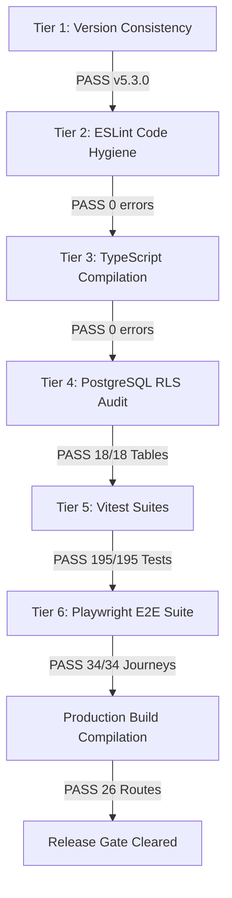

# AdMe Daily System Run & Verification Report

**Date:** 2026-10-02  
**Timestamp:** 2026-10-02T07:12:31-04:00  
**Version:** v5.3.0  
**Environment:** Next.js 16.3.4 (Turbopack) | Node.js v24.x | PostgreSQL 16 (Local Supabase)  

---

## 1. Executive Summary

On 2026-10-02, the AdMe automated software factory executed its scheduled system verification cycle per repository governance mandates. The pre-flight audit revealed zero open items, zero pending PRs, zero unresolved GitHub issues, and full completion of all 14 ratified Architecture Council decisions ([COUNCIL-2026-001](../decisions/COUNCIL-2026-001.md) through [COUNCIL-2026-014](../decisions/COUNCIL-2026-014.md)).

The full 6-tier software verification pipeline and Next.js production build executed with a **100% green pass rate** across all suites. Following successful system verification with zero errors or fixes required, the operational decision engine evaluated a random branch condition (`Math.random() < 0.5 ? 'COUNCIL' : 'REPORT'`), yielding `0.5670575254469126` (`REPORT`). The system prepared this comprehensive run report and successfully concluded all operational tasks until the next cycle.

---

## 2. Pre-Flight Open Items Audit

| Inspection Target | Audit Mechanism | Result | Status |
| :--- | :--- | :--- | :--- |
| **Git Working Tree** | `git status -s` & `git branch -a` | Clean tree on `main`, zero uncommitted diffs | ✅ Clean |
| **Pull Requests** | `gh pr list` | 0 open pull requests | ✅ Clean |
| **GitHub Issues** | `gh issue list` | 0 open issues | ✅ Clean |
| **Council Decisions** | File audit in `docs/decisions/` | 14/14 decisions ratified and implemented | ✅ Complete |
| **Active Implementation Plans** | Project directory scan | 0 pending or in-flight plans | ✅ Complete |
| **Background Task Hygiene** | `manage_task` (action: `list`) | 0 active background tasks / zero orphaned processes | ✅ Clean |

---

## 3. 6-Tier Verification Pipeline Results

The 6-tier release gate executed across all layers of the stack:

### Detailed Tier Breakdown

1. **Tier 1 — Version Consistency Check (`npm run version:check`)**:
   - Status: **PASSED**
   - Output: Version `5.3.0` verified consistent across `package.json` and system configuration.

2. **Tier 2 — Static Analysis & Code Hygiene (`npm run lint`)**:
   - Status: **PASSED**
   - Output: `0 errors`, 73 non-blocking warnings across 26 pages and components.

3. **Tier 3 — Strict TypeScript Compilation (`npm run typecheck` / `tsc --noEmit`)**:
   - Status: **PASSED**
   - Output: 0 compilation errors across entire codebase.

4. **Tier 4 — PostgreSQL Row-Level Security Audit (`npm run audit:rls`)**:
   - Status: **PASSED**
   - Verified 18/18 database tables with active RLS policies:
     - `ad_reports` (2 policies), `ads` (5 policies), `comments` (2 policies), `coupons` (2 policies), `engagements` (3 policies), `geofence_claims` (1 policy), `leads` (3 policies), `localization_activation_history` (1 policy), `localization_catalog_versions` (1 policy), `localization_locales` (1 policy), `localization_review_assignments` (1 policy), `localization_review_decisions` (1 policy), `localization_validation_reports` (1 policy), `payment_transactions` (1 policy), `reward_history` (1 policy), `user_preferences` (3 policies), `users` (3 policies), `viewport_claims` (1 policy).

5. **Tier 5 — Vitest Unit, API Integration & i18n Suite (`npm run test`)**:
   - Status: **PASSED**
   - Test files: 24 passed (24/24)
   - Individual tests: 195 passed (195/195)
   - Duration: 2.55s
   - Coverage: Core business logic, A/B testing splits, location coarse quantization, HMAC engagement heartbeats, CSRF token validation, bilingual i18n adapter, attention budget engine, and community impact dividends.

6. **Tier 6 — Playwright End-to-End Browser Test Suite (`npm run test:e2e`)**:
   - Status: **PASSED**
   - Scenarios: 34 passed (34/34)
   - Duration: 58.0s
   - Coverage: Consumer swipe gestures, Ad Studio campaign creation & CPC bidding, rewards store perk redemption, zero-knowledge Zen Stream / Focus Pass, Intent Tuner resonance ranking, Sensory Shield comfort mode, Community Impact donation routing, and Mindful Attention Budget HUD & soft ceiling milestones.

---

## 4. Production Build Diagnostics (`npm run build`)

Next.js 16.3.4 compiled cleanly using Turbopack with zero warnings or errors:
- Optimization completed in 524ms.
- TypeScript verification completed in 904ms.
- Static page generation: 26/26 routes successfully rendered.
- All dynamic API endpoints (`/api/checkout`, `/api/checkout/verify`, `/api/engagement/*`, `/api/location/*`, `/api/places/*`, `/api/moderation/*`, `/api/studio/copilot`, `/api/webhooks/stripe`) validated.

---

## 5. Operational Decision Engine

Following clean pre-flight verification with zero errors or fixes needed:
- Branch formula: `Math.random() < 0.5 ? 'COUNCIL' : 'REPORT'`
- Evaluated pseudorandom value: `0.5670575254469126`
- Result: **`REPORT`**
- Action: Generated full run report, logged daily execution to [ACTIVITY_LOG.md](../../ACTIVITY_LOG.md), and closed active tasks until next operational day.

---

## 6. Task Hygiene & Process Audit

- Background Tasks Checked: 0 running tasks (`manage_task` action: `list`).
- Open Handles / Network Connections: None.
- System State: Stable, verified, release-ready.
