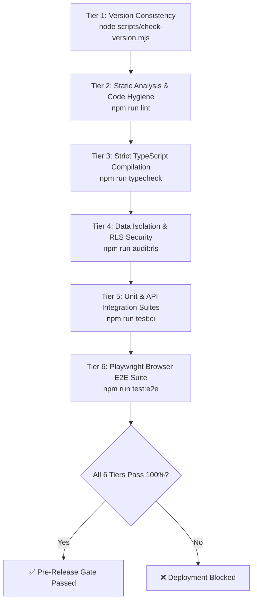

# AdMe Testing Guidelines & Quality Assurance Framework

This document defines the testing architecture, mandatory testing surfaces, execution standards, and pre-release quality gates for the AdMe platform.

---

## 1. Testing Philosophy & Zero-Flake Guarantee

AdMe operates as a privacy-first, permission-based advertising platform handling financial reward accounting, cryptographic viewport dwell verification, Zero-Knowledge preference structures, and automated AI moderation.

To safeguard user trust and platform integrity:
1. **Every Layer Must Be Verified**: We do not rely on mock-only testing or visual inspection alone. Every layer—from PostgreSQL RLS policies to browser render loops—has automated test verification.
2. **Every Feature Ships Testing Surfaces**: No pull request or release containing new functionality may be merged without accompanying unit tests, API integration tests, and Playwright browser E2E tests.
3. **Automated Release Gates**: `npm run test:all` executes all 6 verification tiers. A single red test is a hard stop condition for deployment.

---

## 2. The 6-Tier Verification Pipeline

AdMe employs a strict 6-tier verification sequence orchestrated via `npm run test:all` (`scripts/run-full-test-suite.mjs`):



### Summary of Tiers

| Tier | Command | Scope | Target Threshold |
| :--- | :--- | :--- | :--- |
| **1. Version** | `npm run version:check` | Verifies consistent semantic version across `package.json`, `README.md`, `HOW-TO.md`, `deployment_guide.md`, etc. | 100% Match |
| **2. Lint** | `npm run lint` | ESLint static analysis covering React compiler directives, accessibility attributes, and dead code. | 0 Errors |
| **3. Typecheck** | `npm run typecheck` | Strict `tsc --noEmit` TypeScript compilation across all 26 Next.js routes and lib services. | 0 Errors |
| **4. RLS Audit** | `npm run audit:rls` | Connects to PostgreSQL, audits all public tables for `relrowsecurity = true` and verifies active RLS policies. | 100% Enforced |
| **5. Vitest Suite** | `npm run test:ci` | Executes unit tests, cryptographic HMAC tests, and API integration tests with coverage reporting. | 100% Passing |
| **6. Playwright E2E** | `npm run test:e2e` | End-to-end browser tests in headless Chromium simulating all consumer, advertiser, and admin workflows. | 100% Passing |

---

## 3. Mandatory Testing Surfaces by Feature Type

When implementing or extending features, engineers and autonomous agents must provide test coverage across the corresponding surfaces:

```
┌─────────────────────────────────────────────────────────────────────────┐
│                     MANDATORY TESTING SURFACES MATRIX                   │
├──────────────────────────┬──────────────────────────────────────────────┤
│ Feature Category         │ Required Test Surface                        │
├──────────────────────────┼──────────────────────────────────────────────┤
│ Pure Logic / Algorithms   │ Unit tests in `src/components/*.test.ts` or   │
│                          │ `tests/unit/` (Vitest)                       │
├──────────────────────────┼──────────────────────────────────────────────┤
│ API Route Handlers       │ Integration test in                          │
│                          │ `tests/integration/api-endpoints.test.ts`    │
├──────────────────────────┼──────────────────────────────────────────────┤
│ Database Tables / RLS    │ Row-Level Security in migration + verified by│
│                          │ `scripts/audit-data-isolation.mjs`           │
├──────────────────────────┼──────────────────────────────────────────────┤
│ User Workflows / UI      │ Playwright spec in `tests/e2e/*.spec.ts`     │
├──────────────────────────┼──────────────────────────────────────────────┤
│ Localization / Catalogs  │ i18n validation in                           │
│                          │ `tests/localization/governance.test.ts`      │
└──────────────────────────┴──────────────────────────────────────────────┘
```

### 1. Pure Domain Logic & Services (`tests/unit/` & `src/components/*.test.ts`)
- Target: Ranking algorithms, attention fatigue caps, ZKP swiper physics, ethical scoring, formatters, and pacemakers.
- Standards:
  - Isolate side effects (`Date.now()`, `Math.random()`).
  - Test boundary conditions (empty arrays, quota exceeded, invalid JSON, negative values).
  - Verify deterministic fallback paths.

### 2. API Integration Tests (`tests/integration/api-endpoints.test.ts`)
- Target: Next.js route handlers under `src/app/api/`.
- Standards:
  - Assert HTTP 400 on missing or invalid parameters.
  - Assert HTTP 401 on tampered cryptographic signatures (HMAC dwell tokens, webhooks).
  - Validate response payload schema and zero-knowledge privacy properties.
  - Verify simulated/mock execution for offline testability.

### 3. End-to-End Browser Tests (`tests/e2e/`)
- Target: Full user personas across all 26 application routes.
- Standards:
  - Zero arbitrary sleeps (`page.waitForTimeout` only when transitioning animations).
  - Use semantic locators (`getByRole`, `getByLabel`, `getByPlaceholder`).
  - Test persona switching and state preservation.
  - Verify both English (`EN`) and Spanish (`ES-PR`) runtime DOM translations.

---

## 4. Test Execution Commands

```bash
# Run the entire 6-tier verification suite (Release Gate)
npm run test:all

# Run unit tests only
npm run test:unit

# Run API integration tests only
npm run test:integration

# Run Playwright E2E browser tests
npm run test:e2e

# Run Data Isolation & RLS security audit
npm run audit:rls

# Run TypeScript typecheck
npm run typecheck

# Run ESLint
npm run lint
```

---

## 5. Release-Gating Checklist

Before merging any branch to `main` or tagging a release:
- [ ] `npm run test:all` executes and reports **PASSED** across all 6 tiers.
- [ ] New API endpoints are registered in `tests/integration/api-endpoints.test.ts`.
- [ ] New UI flows have a corresponding Playwright spec in `tests/e2e/`.
- [ ] Database changes include RLS policies verified by `npm run audit:rls`.
- [ ] Version number is incremented and consistent across documentation.
- [ ] Architecture Decision Record (ADR) committed under `docs/decisions/` if architectural boundaries changed.
