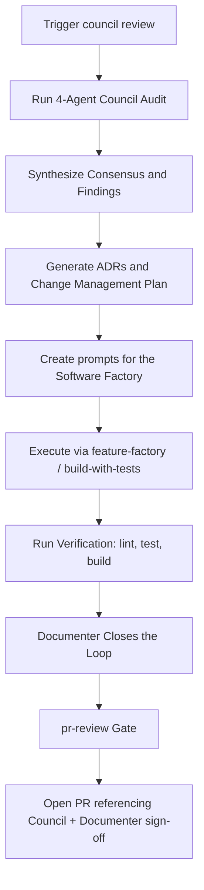

# IMPROVE-SOFTWARE — Council Review & Software Factory Protocol

This protocol defines the repeatable cycle of auditing code (the 4-agent audit Council), planning changes (ADRs and change management), executing features/fixes (the software factory), reviewing before merge (`pr-review`), and closing the loop (the Documenter) for **AdMe**.

## 0. Mandate

**The Council runs before every merge to the default branch.** This is not optional for meaningful work. Any PR of non-trivial size (new feature, schema change, security-relevant change, or an accumulated multi-commit branch) must have a Council pass and Documenter sign-off referenced in the PR description before merge. Small, isolated fixes (typo, single-line config, a dependency bump with no behavior change) may skip the Council — but the exception is the branch being small, not the reviewer being in a hurry.

**The `pr-review` gate applies to every PR regardless of size** — it is separate from, and does not replace, the Council mandate above.

The Council is five agents, not four:
- **Agents 1–4:** read-only audit — data/API, routes/pages, UX/shell, feature/competitive.
- **Agent 5 — Documenter:** write role. Runs after synthesis and after factory execution verifies cleanly. Updates the planning doc, `CHANGELOG.md`, README/docs, finalizes ADRs, commits the Council's own output, and writes memory/handoff notes.

Do not let audits run and stop at "findings noted" with no Documenter step — that is how planning docs and changelogs silently drift out of sync with what actually shipped.

---

## 1. The Improvement Command Cycle



1. **Audit (Council):** spawn 4 read-only agents in parallel with the prompts below, substituting the repo root and AdMe specifics.
2. **Synthesize:** group findings into cross-agent consensus, list architectural decisions, outline sequence of work.
3. **ADRs:** draft an ADR under `docs/adr/` (matching the `docs/decisions/COUNCIL-YYYY-NNN.md` format) for any new boundary, role-access pattern, integration contract, or data-exposure rule the Council identifies.
4. **Change Management:** turn agreed findings into concrete, sequenced implementation prompts.
5. **Software Factory Execution:** hand prompts to `feature-factory` / `build-with-tests`.
6. **Verification:** once lint (`npm run lint`), test (`npm run test`), and build (`npm run build`) are clean, proceed — not before. A red result routes back to the builder, not forward to Documenter.
7. **Documentation Close-Out (Documenter):** update `ARCHITECTURE.md`, `CHANGELOG.md`, `README.md`, `ACTIVITY_LOG.md`, ADRs, and memory.
8. **`pr-review` gate:** run `pr-reviewer` against the finished diff; resolve Critical/Important findings.
9. **PR:** only after Documenter and `pr-review` sign-off does the branch open a PR, referencing the Council synthesis and confirming both sign-offs in the description.

---

## 2. Phase 1: Spawning the Council (Audit Prompts)

Repo root: `/Users/rjulia/programs/AdMe`

### Agent 1 — Data & API Audit

```
You are Council Agent 1 for AdMe. Your job is a data and API state audit. READ-ONLY — do not edit any files.

Repo root: /Users/rjulia/programs/AdMe

Produce a structured report covering:

1. Schema/migrations — inventory all PostgreSQL table/model definitions under supabase/migrations/. List each table, whether Row-Level Security (RLS) is enforced, and flag any with missing policies or orphan tables without references in application code.
2. Lib & Server Utilities — list major modules in src/lib/ (auth, services, hooks, i18n, db). For each, note key types and whether matching tests exist under tests/ or src/. Flag gaps.
3. API Routes/Endpoints — list every Next.js route handler under src/app/api/ with its HTTP method, role check, and RLS/HMAC protection.
4. App Pages/Views — list every page/route under src/app/. Flag any that are redirect-only or empty stubs.
5. Seed/fixture data — check scripts/seed-production-ads.ts and localization test fixtures. Are they realistic? What's missing (failure paths, edge cases, recurring/periodic data)?
6. Top 5 critical gaps for data/API security and completeness in AdMe — be specific and honest, and verify each claim against the actual code/config rather than assuming.

Return concise structured markdown, 500–700 words. Name every gap specifically.
```

### Agent 2 — Route & Page Audit

```
You are Council Agent 2 for AdMe. Your job is a route and page audit. READ-ONLY.

Repo root: /Users/rjulia/programs/AdMe

1. Shell/nav inventory — inspect AdMe's navigation components (Navbar.tsx, BottomNav.tsx, StudioNav.tsx, etc.). List every nav destination.
2. Page existence check — for every destination, verify a real Next.js page exists in src/app/. Mark EXISTS / STUB (redirect or near-empty) / MISSING across all 26 routes.
3. API completeness — for every client action that calls an endpoint (/api/engagement/*, /api/checkout, /api/studio/*, etc.), verify the endpoint exists. Report orphaned handlers.
4. Link consistency — hardcoded links pointing at routes with no implementation.
5. Summary table: | Route | Shell | Page Status | Notes |

Return concise structured markdown, 400–600 words. Name every stub and missing route.
```

### Agent 3 — UX & Shell Audit

```
You are Council Agent 3 for AdMe. Your job is a UX and shell quality audit. READ-ONLY.

Repo root: /Users/rjulia/programs/AdMe

1. Accessibility correctness — scan shell/nav/interactive components (FeedCard, NativeAdCard, CarouselAdCard, ScratchCard, ZkpWebGLSwiper, CreativeCopilot, AttentionShieldBadge) for correct ARIA usage (aria-expanded, aria-selected, aria-label, aria-current). Flag strings where booleans are needed, or missing where required.
2. Loading and empty states — do feed, studio, wallet, and rewards pages handle empty data and slow loads gracefully, or crash/blank-screen?
3. Styling completeness — are referenced CSS styles/classes actually defined? Is it responsive on mobile viewports?
4. Nav active-state consistency across consumer and studio layouts.
5. Error handling — inspect src/app/error.tsx, global-error.tsx, or root-level error boundary. Do server components and client handlers degrade gracefully?
6. Top 3 UX pain points a real user or merchant would hit today.

Return concise structured markdown, 400–600 words. Be specific, with file/line references.
```

### Agent 4 — Feature & Competitive Audit

```
You are Council Agent 4 for AdMe. Your job is feature completeness and competitive gap analysis. READ-ONLY.

Repo root: /Users/rjulia/programs/AdMe

Read first: ARCHITECTURE.md, docs/AI_COUNCIL_ARCHITECTURE_AND_IMPLEMENTATION_SPEC.md, docs/BUSINESS_MODEL_AND_UNIT_ECONOMICS.md, and docs/decisions/.

1. Workflow completion — % complete for each of AdMe's core modules:
   - Privacy-first feed & Attention Shield (COUNCIL-2026-009)
   - Zero-Knowledge preference onboarding
   - Ad Studio campaign creation & Creative Co-Pilot (COUNCIL-2026-008)
   - Voucher minting & coupon wallet
   - Rewards ledger & Stripe payment fulfillment
   - Localization governance (EN / ES-PR)
2. User role coverage — rate validation for Consumer, Merchant/Advertiser, and Admin roles.
3. Core operations workflows — rate completeness of highest-risk workflows (HMAC dwell verification, point redemption, Stripe checkout).
4. Competitive gap — vs. traditional ad networks (Google/Meta Ads) and privacy-first reward networks (Brave Rewards).
5. Readiness score, 0–100, with justification. Be honest, not encouraging.

Return concise structured markdown, 500–700 words.
```

---

## 3. Phase 2: Synthesis & Change Management

After all agent reports:

1. **Cross-Agent Consensus** — findings multiple agents independently flagged; highest priority. Explicitly verify (not assume) any factual claim before it goes into the synthesis.
2. **ADR Drafts** — for every new boundary, role-access pattern, integration contract, or data-exposure rule, under `docs/adr/`, following the `docs/decisions/COUNCIL-YYYY-NNN.md` schema.
3. **Implementation Prompts**, one per agreed change:
   ```
   ## Prompt [LETTER] — [SHORT TITLE]
   **ADR Reference:** ADR-XXXX / COUNCIL-YYYY-NNN (if applicable)
   **Files:** [files to create/modify]
   **Scope:** [1–3 sentences]
   **Work:** [numbered steps]
   **Verification:** [lint / test / build / anything additional]
   ```
4. **Execution Order** — dependency-ordered; note what's parallelizable.
5. **Scope note** — if the Council was run as a full audit against a small/scoped branch rather than a diff-scoped review of that branch, say so explicitly.

---

## 4. Phase 3: Software Factory Processing

Every prompt from synthesis goes through `feature-factory` / `build-with-tests`.

### Code Quality & Implementation Standards
- No impure operations (`Date.now()`, `Math.random()`, network/DB calls) inside render paths — isolate side effects in hooks or server utilities.
- Consumer and advertiser/merchant data surfaces stay strictly isolated via PostgreSQL RLS.
- All database changes enforce row-level security; run `npm run audit:rls` to verify.
- Retain existing comments, type boundaries, and docstrings unrelated to the current change.
- Never commit directly to `main`.

### Sanity Checks & Testing Surfaces (per `docs/testing/TESTING_GUIDELINES.md`)
1. Unit test coverage near any pure logic or domain service.
2. API integration test in `tests/integration/api-endpoints.test.ts` for any endpoint change.
3. Playwright browser E2E test in `tests/e2e/` for any user-facing flow.
4. Clean execution of the full 6-tier pipeline: `npm run test:all` (Version, Lint, Typecheck, RLS Audit, Unit/Integration, Playwright E2E).
5. `npm run build` (Next.js production build with 0 errors).

Only once all tiers are clean does work move to Phase 4. A red result is a stop condition, not a Documenter task.

---

## 5. Phase 4: Documentation Close-Out (Documenter)

Runs once Phase 3 is clean and before a PR opens.

**Task:** make finished, verified work legible to anyone reading the repo without this conversation.

**Work:**
1. Update `ARCHITECTURE.md` and `ACTIVITY_LOG.md` — correct status to match reality.
2. Add a `CHANGELOG.md` `[Unreleased]` entry.
3. Update `README.md` and affected `/docs` pages for meaningful changes.
4. Finalize any ADR referenced by the synthesis.
5. Confirm the Council's own `docs/reviews/` output is committed.
6. Update persistent memory with new mandates, decisions, or recurring gotchas.
7. Write one committed handoff note (PR description or `docs/factory-runs/` entry).

---

## 6. Phase 5: PR Review Gate

Before any PR opens, run `pr-review` (`pr-reviewer` subagent) against the full diff. It ranks findings Critical → Important → Minor and cannot merge/approve/close anything. Critical or Important findings block the PR until resolved; Minor findings are the author's call.

---

## Output Location

Commit, every Council round:
- `docs/reviews/YYYY-MM-DD-council-review-[N]-synthesis.md`
- `docs/reviews/YYYY-MM-DD-council-review-[N]-agent-[1-4]-*.md`
- `docs/adr/COUNCIL-YYYY-NNN.md` (or `docs/decisions/COUNCIL-YYYY-NNN.md`) for any new ADRs
- Documenter's updates to `CHANGELOG.md`, `README.md`, `ACTIVITY_LOG.md`, `/docs`, and memory
